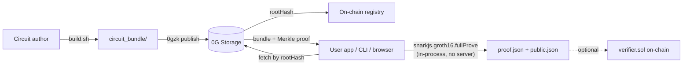

# 0gzk

> **ZK Proof-as-a-Service on 0G Storage — publish Circom circuits once, prove anything client-side via SDK or CLI. Witnesses never leave the device.**

[](https://www.npmjs.com/package/@0gzk/sdk)
[](https://www.npmjs.com/package/@0gzk/cli)
[](./LICENSE)

Circuit authors compile a Circom circuit, run a one-shot trusted setup, and publish the resulting `circuit_bundle/` (wasm + zkey + verification key + verifier contract + metadata) to **0G Storage** as a single content-addressed `tar.gz`. The returned `rootHash` is the bundle's CID. Anyone can fetch it back, validate inputs against the circuit's schema, and produce a Groth16 proof locally — in Node, in a browser, or via the `0gzk` CLI. Optional on-chain verification uses the auto-generated `verifier.sol`.

## Architecture



Two SDK surfaces, picked automatically by your runtime:

- **`@0gzk/sdk`** (isomorphic) — `generateProof`, `verifyLocal`, `validateInputs`. Works in Node and in the browser. Wraps `snarkjs.groth16` with metadata-driven input validation.
- **`@0gzk/sdk/node`** (Node-only subpath) — `uploadBundle`, `fetchBundle`, `loadConfig`, `readBundleFromDir`. Talks to 0G Storage via `@0gfoundation/0g-ts-sdk`.

## Install

```bash
# Library
npm i @0gzk/sdk snarkjs

# CLI (provides the `0gzk` binary)
npm i -g @0gzk/cli
```

## Use the SDK

```ts
import { generateProof, verifyLocal, type BundleFiles } from "@0gzk/sdk";

const bundle: BundleFiles = {
  wasm,            // Uint8Array of circuit.wasm
  zkey,            // Uint8Array of circuit_final.zkey
  vkey,            // parsed verification_key.json
  metadata,        // parsed metadata.json (CircuitMetadata)
};

const inputs = { birthYear: 1990, currentYear: 2026, minAge: 18 };
const { proof, publicSignals } = await generateProof(bundle, inputs);
const ok = await verifyLocal(bundle, { proof, publicSignals });
```

In Node you can pull the bundle off 0G Storage instead of constructing one by hand:

```ts
import { fetchBundle, loadConfig } from "@0gzk/sdk/node";

const config = loadConfig();
const bundle = await fetchBundle(rootHash, config, "/tmp/my-bundle");
```

## Use the CLI

```bash
# Publish a circuit bundle to 0G Storage (needs OG_PRIVATE_KEY funded on Galileo testnet)
0gzk publish ./circuit_bundle

# Fetch a bundle by root hash
0gzk fetch 0x5aa4e2... /tmp/0gzk-fetched

# Generate a proof locally - bundle source is exclusive: --bundle dir/ or --root-hash 0x...
0gzk prove --bundle ./circuit_bundle ./input.json
0gzk prove --root-hash 0x5aa4e2...   ./input.json
```

`0gzk prove` writes `proof.json`, `public.json`, and a roll-up `result.json` into `./proof-<timestamp>/`. Outputs are byte-compatible with the canonical `snarkjs` CLI — anyone can verify them with `snarkjs groth16 verify`. Bundles fetched by root hash are cached at `~/.0gzk/bundles/<rootHash>/` for instant reuse (override with `OGZK_CACHE_DIR`).

## Repository layout

This is a `pnpm` workspaces monorepo:

| Path                  | What                                                                                   |
| --------------------- | -------------------------------------------------------------------------------------- |
| `packages/sdk/`       | [`@0gzk/sdk`](./packages/sdk) — isomorphic prover + Node-only 0G Storage helpers       |
| `packages/cli/`       | [`@0gzk/cli`](./packages/cli) — the `0gzk` binary                                      |
| `packages/contracts/` | Foundry project for the on-chain circuit registry + Groth16 verifiers (planned)        |
| `circuits/`           | Source circuits (e.g. `age_verification`) and their `build.sh` scripts                 |
| `web/`                | [Next.js 16 web prover](./web) — separate git repo, consumes `@0gzk/sdk` from npm      |

## Develop from source

### Prerequisites

- Node.js 20+
- pnpm 9+ (`npm i -g pnpm`)
- [`circom`](https://docs.circom.io/getting-started/installation/) compiler (Rust binary; not on npm)
- bash — required for `circuits/*/build.sh`. On Windows use **git-bash** or **WSL**.

### Build

```bash
pnpm install
pnpm -r build
```

### Build the reference circuit

```bash
cd circuits/age_verification
bash build.sh
```

This compiles `age_verification.circom`, downloads the Powers of Tau (with blake2b integrity check), runs the snarkjs trusted setup, and emits a self-contained `circuit_bundle/` (wasm + zkey + verification key + Solidity verifier + metadata).

### End-to-end smoke test

```bash
# Local prove against the bundle you just built
node packages/cli/dist/index.js prove \
  --bundle circuits/age_verification/circuit_bundle \
  circuits/age_verification/example_input.json
# -> proof-<timestamp>/, "verified": true, publicSignals: ["1","2026","18"]
```

## Network configuration

The Node surface and the CLI default to 0G Galileo testnet (chain ID **16602**). Configure via env vars or per-command flags:

| Variable          | Default                                           | Purpose                                      |
| ----------------- | ------------------------------------------------- | -------------------------------------------- |
| `OG_NETWORK`      | `testnet`                                         | `testnet` (Galileo) or `mainnet`             |
| `OG_PRIVATE_KEY`  | —                                                 | Funded `0x...` key, required for `publish`   |
| `OG_RPC_URL`      | `https://evmrpc-testnet.0g.ai`                    | EVM RPC override                             |
| `OG_INDEXER_URL`  | `https://indexer-storage-testnet-turbo.0g.ai`     | 0G Storage indexer override                  |
| `OGZK_CACHE_DIR`  | `~/.0gzk/bundles`                                 | Where `0gzk prove --root-hash` caches bundles |

Get testnet 0G from the [official faucet](https://faucet.0g.ai). Downloads (`fetch`, remote `prove`) do not require a wallet.

## Roadmap

- [x] Monorepo scaffolding (pnpm workspaces, strict TypeScript, shared base config)
- [x] Reference circuit `age_verification` with one-shot reproducible `build.sh`
- [x] 0G Storage round-trip: `0gzk publish` and `0gzk fetch` with on-chain receipt
- [x] Prover engine: snarkjs Groth16 with metadata-driven input validation, bundle disk cache
- [x] `@0gzk/sdk` and `@0gzk/cli` published to npm (v0.1.0)
- [ ] Next.js web app: pick a circuit by root hash, prove in-browser, witness never leaves the tab
- [ ] On-chain circuit registry (`CircuitRegistry.sol`) + thin client adapter
- [ ] On-chain Groth16 verification helper in `@0gzk/sdk/onchain`
- [ ] Marketplace UI surfacing community-published circuits

See [CHANGELOG.md](./CHANGELOG.md) for release notes.

## Why 0G Storage

Circuit artifacts (wasm + zkey) are megabytes — too expensive to host on Ethereum and too central to put on a single CDN. 0G Storage is decentralized, content-addressed, DA-optimized, and cheap enough to host hundreds of circuits at platform scale. The `rootHash` is portable: any client with the indexer URL can pull a verified copy.

## Why client-side proving

Witness data (the private inputs to the proof) must never leave the prover's machine — that's the whole point of zero knowledge. `snarkjs.groth16.fullProve` runs everywhere Node and modern browsers run, so the SDK ships exactly that path: bundle bytes in, `proof + publicSignals` out. No proving server, no trust delegation, no leak surface.

## License

[MIT](./LICENSE) — see also the per-package licenses inside `packages/sdk/` and `packages/cli/`.
